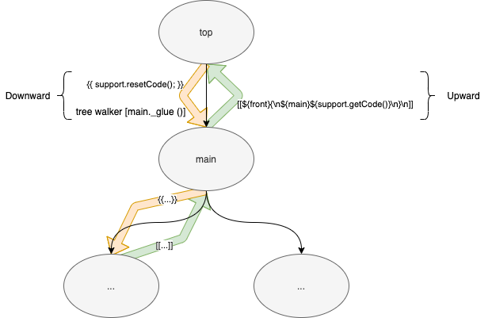

# Synopsis

This directory contains a demo of transpiling datalog.ohm using 2 preprocessing steps

1. convert `[,xxx]` into `("," xxx)` 

2. replace `(...)` by a generated rule, appending the generated rule(s) at the bottom of the .ohm file

We create newly-invented syntax for [`,Rule]`.  See datalog_new.ohm for an example of the new syntax[^2].  

[^2]: Q: Is this new syntax "better"? What about using it in non-toy examples?.

The "new syntax" is a macro.

The "new syntax" *could* be replaced by parenthesized rules, or, by Ohm-JS' parameterized rules.

[N.B. This only transforms the grammar, but not the .glue file. This implies that the programmer must explicitly insert Gen_??? rules into the .glue file. It should be possible to transform the .ohm *and* the .glue files in a way that is transparent to the programmer - exercise left to reader :-].


# Further Elaboration

Currently the Glue DSL does not allow for some of Ohm-JS's "high level" parsing constructs. 

Namely, parameterized rules are not recognized by Glue.

OTOH, we have created the `PFR` tool which can be used in a pipeline of preprocessors to Ohm-JS.

We decided to invent a new syntax for the original "toy" grammar - datalog.ohm.

In this new syntax, we can say `[, rule]`" where *rule* is any other rule (upper case or lower case).

Grokking this new syntax is easy. We do it in two steps.

## Step 1

In step 1 we transpile `[, *rule*]` into `("," *rule*)`.

## Step 2

This, then, creates a grammar that is still not grokkable by Glue.

Glue currently cannot process parenthesized expressions that have postfix operators, eg. ?/*/+.

Hence, constructs such as `("," rule)*`, cannot be processes by Glue (at this time).

This problem is alleviated by a *second* preprocessing step.

We convert `(...)` into `Gen_NN` and create brand new rules `Gen_NN = ...`.

# Run.bash

In run.bash, we preprocess the new grammar using a pipeline, then we run the preprocessed grammar.

```
#!/bin/bash
cwd=`pwd`
pfr datalog_new.ohm pre.ohm pre.glue | pfr - pre2.ohm pre2.glue $cwd/support.js >pdatalog.ohm
pfr test.datalog pdatalog.ohm pdatalog.glue
```

1. The first line tells the operating systems to use the `bash` command processor.
2. The second line sets up the variable `cwd` to contain the current directory (the output of the `pwd` command using back-tick shell syntax.
3. The third line is the preprocessing pipeline. It begins working on datalog_new.ohm and passes the result to the next `pfr` command in the pipeline (the second `pfr` reads input from `stdin` signified by the `-` parameter).  Both of the preprocessors are based on the `pfr` command which takes at least 3 arguments (a) the input file, (b) the grammar, and, (c) the rewrite specification (.glue).  If a 4th argument is specified, it gives the (full) name of support code (currently written in JavaScript).  `Support.js` is needed only for the 2nd preprocessor in this (simple) case. [5th and 6th arguments are available, too, but not used here - they only exist to help in debugging - see the [PFR manual](https://guitarvydas.github.io/2021/10/14/PFR-and-PF.html) for further details].
4. The 4th (final) line runs the preprocessed grammar against a toy test example `test.datalog`.

# Generating Rules

Step 2 generates new grammar rules by creating new strings.  

The new rule strings are written out at the end of the parse (by the top-most rule).

The new rules are generated in the rule `parenOp` by calling the function `support.newCode (...)` which is in the file `support.js`.

To create rules, we use the Glue `{{}}` feature which allows "arbitrary" JavaScript code to be inserted during the tree-walk of the CST (aka AST).  The `{{}}` rules operate in a *downward* manner while the `[[]]` rules generate strings and pass them back *upward*.

*Downward* code is executed in a CST *node* before any of the *children* of the node are walked.

The walking order is shown in the figure below (downward is coloured yellow, upward is coloured green):





# Appendix - Warts

1. At the moment, Glue uses the implementation language of Ohm-JS, i.e. JavaScript.  We could write more preprocessors to express Glue' operations in some invented  DSL notation.
2. The generated rules are Ohm-JS *syntactic* rules (rules that begin with a capital letter).  This may or may not be applicable in all cases.  It should be easy to convert the rules to *lexical* rules[^1].
3. We cheat by converting *all* `(...)` expressions into new rules.  This cheat works for this example, but might no be applicable in all use-cases.[^3]

[^3]: 95% of a solution is OK as long as there is way to "break out" and create more detailed code for the 5% of solutions that don't fit.  There is no reason to spend time (brain-power) generalizing this particular solution when PEG (PFR, Ohm-JS) can be used to quickly create other specific cases.
[^1]: A *syntactic* rule can be changed into a *lexical* rule simply by changing the first letter of the rule to lower-case in `support.js`. See the Ohm-JS documentation for descriptions of the differences between these two kinds of rules. 

# Appendix - Toolbox Languages

Note that the idea of relying on the underlying (toolbox) language can be applied in many ways, e.g. in using diagrams as syntax.

In essence, we use the `PFR` tool (Ohm-JS) in a *layered* manner.  We use `PFR` to create parsers for us, but we "break out" into using JavaScript for lower-level operations and operations not supported by the upper layers.

We don't need to invent complete new syntaxes for every kind of operation, we simply generate a layer of code and paste it over top of a toolbox language (in this case, JavaScript).

`PFR` - Ohm-JS - is the upper layer in this case.  The toolbox languages in this case are:

1. JavaScript
2. Bash (*NIX shell).

We use Bash to create pipelines of `PFR` commands.

The resulting solution uses 3 languages to construct a 4th language - Ohm-JS, JavaScript and Bash, to generate a form of Datalog (which is used with Python, yet another toolbox language in another project).

The idea of using *only* one language (/ paradigm) for the project is a barrier to getting things done.  We plumb several languages together to produce a result.

We used 2 simple preprocessing steps to produce a notation (aka light-weight DSL) for another project.

The preprocessing steps are contained in files `pre.ohm`, `pre.glue`, `pre2.ohm` and `pre2.glue`.

The other project uses Python with a datalog-like layer on top. Our new syntax is based on `datalog` but is completely maleable and fits over top of our Python libraries.

# Authors

Rajiv Abraham

Paul Tarvydas
